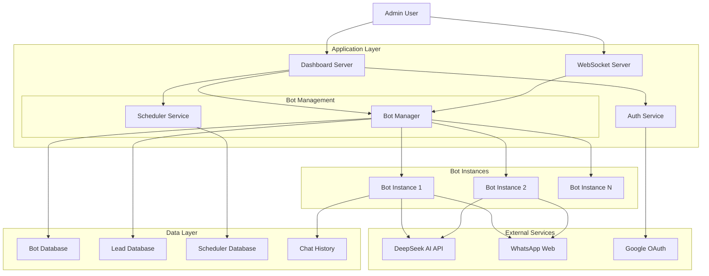
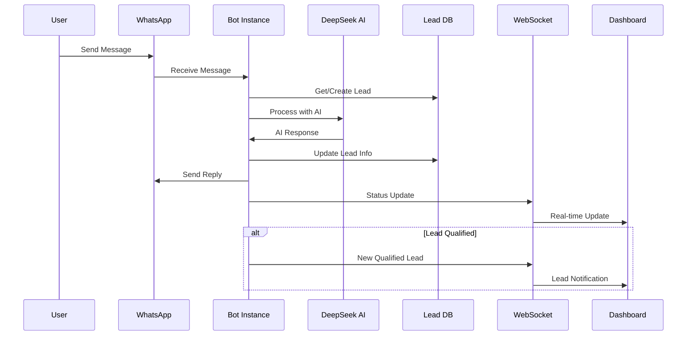
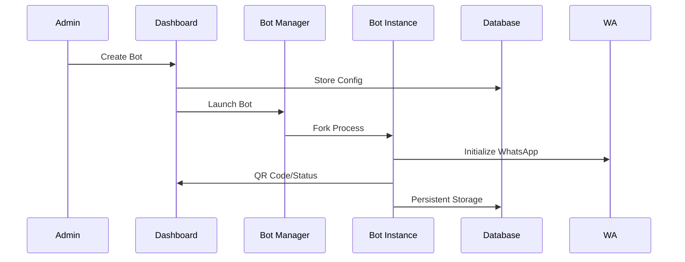
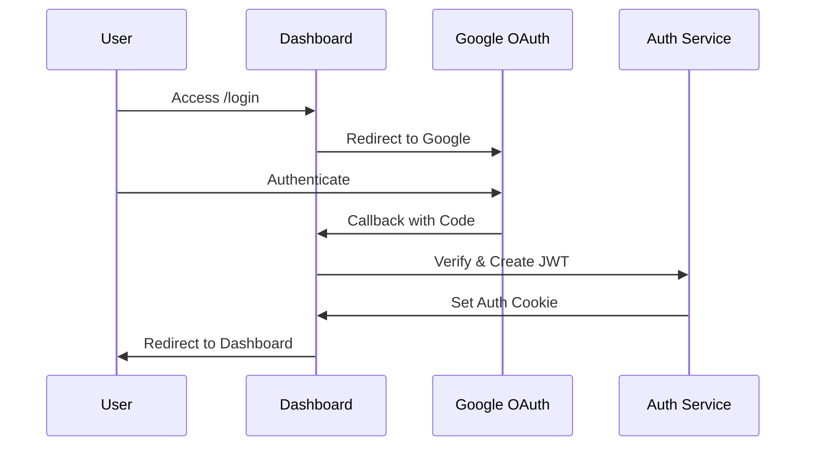

# WhatsApp Bot Manager - Technical Architecture

## Executive Summary

The WhatsApp Bot Manager is a sophisticated multi-tenant platform that enables businesses to deploy and manage multiple AI-powered WhatsApp bots through a centralized dashboard. The system combines intelligent lead capture, automated conversation management, and real-time sales team coordination to streamline customer engagement and lead qualification processes.

## Technology Stack

### Core Platform
- **Runtime**: Node.js 18.x
- **Web Framework**: Express.js 4.18.3
- **Template Engine**: EJS 3.1.9
- **Real-time Communication**: WebSocket (ws 8.16.0)
- **Process Management**: Node.js Child Processes

### AI & Automation
- **AI Service**: DeepSeek Chat API
- **WhatsApp Integration**: whatsapp-web.js (pedroslopez fork)
- **QR Code Generation**: qrcode 1.5.3

### Data Layer
- **Database**: SQLite with better-sqlite3 9.4.3
- **Session Management**: JWT with jsonwebtoken 9.0.2
- **File Storage**: Local filesystem with structured directories

### Authentication & Security
- **OAuth Provider**: Google OAuth 2.0 with passport-google-oauth20 2.0.0
- **Session Security**: JWT tokens with configurable secrets
- **Cookie Management**: cookie-parser 1.4.6

### Infrastructure
- **Deployment Platform**: Railway.app
- **Containerization**: Nixpacks
- **Environment Management**: dotenv 16.4.5

## System Architecture

### High-Level Component Diagram



### Core Components

#### 1. Dashboard Server ([`dashboardServer.js`](dashboardServer.js:1))
- **Primary Responsibilities**:
  - HTTP request handling and routing
  - WebSocket server management
  - Bot process orchestration
  - Real-time dashboard updates
  - Authentication middleware enforcement

#### 2. Bot Instance Manager ([`botInstance.js`](botInstance.js:1))
- **Responsibilities**:
  - WhatsApp client initialization and management
  - AI-powered message processing
  - Lead information extraction and qualification
  - Real-time status reporting to dashboard

#### 3. Service Layer
- **Bot Configuration Service** ([`services/botConfigService.js`](services/botConfigService.js:1)): Manages bot features and settings
- **Lead Database Service** ([`services/leadDbService.js`](services/leadDbService.js:1)): Handles lead capture and management
- **Scheduler Service** ([`services/schedulerService.js`](services/schedulerService.js:1)): Manages automated bot scheduling
- **DeepSeek Service** ([`services/deepseekService.js`](services/deepseekService.js:1)): AI conversation handling
- **Lead Extraction Service** ([`services/leadExtractionService.js`](services/leadExtractionService.js:1)): Intelligent information parsing

## Data Flow Architecture

### User Request Processing Flow



### Bot Management Flow



## Infrastructure & Deployment

### Hosting Environment
- **Platform**: Railway.app with automatic deployments
- **Runtime**: Node.js 18.x with Chromium dependency
- **Scaling**: Horizontal scaling through multiple bot instances
- **Persistence**: Railway-managed file system for SQLite databases

### Container Configuration ([`nixpacks.toml`](nixpacks.toml:1))
```toml
[phases.setup]
nixPkgs = ["nodejs-18_x", "chromium"]

[phases.install]
cmds = ["npm ci --production"]

[start]
cmd = "npm start"
```

### Railway Configuration ([`railway.json`](railway.json:1))
- **Builder**: NIXPACKS
- **Start Command**: `npm start`
- **Restart Policy**: ON_FAILURE with 10 retries

## Authentication & Security Architecture

### OAuth 2.0 Flow


### Security Measures
- **JWT Token Management**: Secure token storage in HTTP-only cookies
- **Admin Access Control**: Configurable admin email whitelist
- **Session Protection**: Automatic token validation and cleanup
- **Environment Security**: Sensitive configuration in environment variables

## Database Schema

### Bot Management Database ([`services/botDbService.js`](services/botDbService.js))
```sql
CREATE TABLE bots (
    id TEXT PRIMARY KEY,
    name TEXT NOT NULL,
    port INTEGER NOT NULL,
    prompt TEXT NOT NULL,
    status TEXT DEFAULT 'enabled',
    ownerEmail TEXT NOT NULL,
    createdAt DATETIME DEFAULT CURRENT_TIMESTAMP
);
```

### Lead Management Database ([`services/leadDbService.js`](services/leadDbService.js:14))
```sql
CREATE TABLE leads (
    id INTEGER PRIMARY KEY AUTOINCREMENT,
    botId TEXT NOT NULL,
    whatsappNumber TEXT NOT NULL,
    name TEXT, email TEXT, location TEXT, phone TEXT,
    status TEXT DEFAULT 'capturing',
    assignedTo TEXT,
    capturedAt DATETIME DEFAULT CURRENT_TIMESTAMP,
    qualifiedAt DATETIME,
    lastMessageAt DATETIME DEFAULT CURRENT_TIMESTAMP,
    UNIQUE(botId, whatsappNumber)
);

CREATE TABLE lead_messages (
    id INTEGER PRIMARY KEY AUTOINCREMENT,
    leadId INTEGER NOT NULL,
    sender TEXT NOT NULL,
    message TEXT NOT NULL,
    timestamp DATETIME DEFAULT CURRENT_TIMESTAMP,
    FOREIGN KEY (leadId) REFERENCES leads(id)
);
```

### Feature Configuration Database ([`services/botConfigService.js`](services/botConfigService.js:14))
```sql
CREATE TABLE bot_features (
    id INTEGER PRIMARY KEY AUTOINCREMENT,
    botId TEXT NOT NULL UNIQUE,
    schedulingEnabled BOOLEAN DEFAULT 0,
    autoResponseEnabled BOOLEAN DEFAULT 1,
    leadCaptureEnabled BOOLEAN DEFAULT 1,
    workingHoursEnabled BOOLEAN DEFAULT 0,
    workingHoursStart TEXT DEFAULT '09:00',
    workingHoursEnd TEXT DEFAULT '18:00',
    updatedAt DATETIME DEFAULT CURRENT_TIMESTAMP
);
```

### Scheduler Database ([`services/schedulerService.js`](services/schedulerService.js:15))
```sql
CREATE TABLE schedules (
    id INTEGER PRIMARY KEY AUTOINCREMENT,
    botId TEXT NOT NULL,
    action TEXT NOT NULL,
    scheduledAt DATETIME NOT NULL,
    status TEXT DEFAULT 'pending',
    executed BOOLEAN DEFAULT 0,
    executedAt DATETIME,
    createdBy TEXT NOT NULL,
    createdAt DATETIME DEFAULT CURRENT_TIMESTAMP
);
```

## Core Functionality & Operational Logic

### Multi-Tenant Bot Architecture
- **Isolated Instances**: Each bot runs in separate child processes
- **Independent Authentication**: Unique WhatsApp sessions per bot
- **Configurable Prompts**: Custom AI behavior per bot instance
- **Resource Management**: Automatic process cleanup and restart

### Intelligent Lead Capture System
1. **Initial Contact**: Bot engages user with AI-powered responses
2. **Information Extraction**: Uses DeepSeek AI to parse contact details
3. **Progressive Qualification**: Systematically collects name, email, location, phone
4. **Automatic Handoff**: Qualified leads transferred to sales team
5. **Conversation Continuity**: Sales team can continue conversations seamlessly

### Real-time Communication Framework
- **WebSocket Events**: Live bot status, lead notifications, message updates
- **Bi-directional Communication**: Dashboard to bots and vice versa
- **State Synchronization**: Consistent view across all connected clients
- **Event-driven Architecture**: Reactive updates based on system events

### Automated Scheduling System
- **Time-based Actions**: Enable/disable bots at specified times
- **Recurring Tasks**: 30-second interval for pending task execution
- **Feature Gates**: Scheduling only available when feature enabled
- **Audit Trail**: Complete history of scheduled actions and executions

## Scalability Considerations

### Current Architecture Strengths
- **Process Isolation**: Bot failures don't affect dashboard or other bots
- **Horizontal Scaling**: Can deploy multiple dashboard instances
- **Stateless Authentication**: JWT tokens enable distributed sessions
- **Database Partitioning**: Separate SQLite files for different concerns

### Potential Scaling Challenges
- **SQLite Limitations**: Single-writer constraint in concurrent environments
- **Memory Management**: Multiple Chromium instances in bot processes
- **WebSocket Connections**: Scaling real-time connections across instances
- **File System Dependencies**: SQLite file access in distributed environments

### Recommended Scaling Path
1. **Database Migration**: Move to PostgreSQL for concurrent access
2. **Process Optimization**: Implement bot pooling and resource limits
3. **Message Queue**: Add Redis for event distribution
4. **Container Orchestration**: Kubernetes for bot instance management

## Monitoring & Observability

### Built-in Monitoring
- **Process Health**: Automatic bot restart on failure
- **Connection Status**: Real-time WhatsApp connection monitoring
- **Lead Pipeline**: Track lead conversion and qualification rates
- **Scheduler Execution**: Audit trail for automated actions

### Operational Metrics
- **Bot Uptime**: Individual bot connection stability
- **Message Throughput**: Conversation volume per bot
- **Lead Conversion**: Capture to qualification ratios
- **AI Response Times**: DeepSeek API performance

This architecture provides a robust foundation for managing multiple WhatsApp bots with intelligent lead capture, real-time coordination, and scalable infrastructure designed for business-grade deployment.