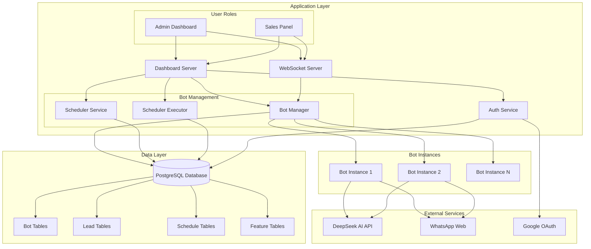
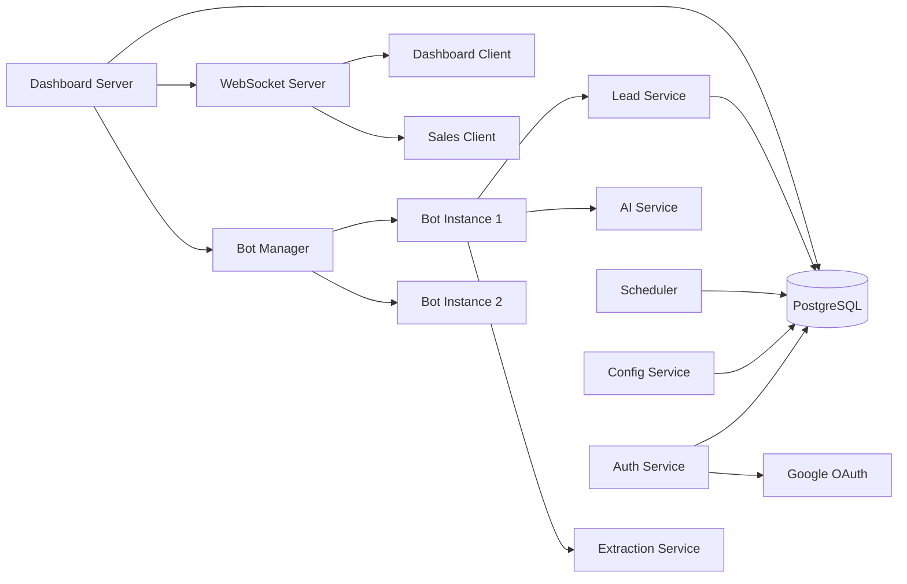
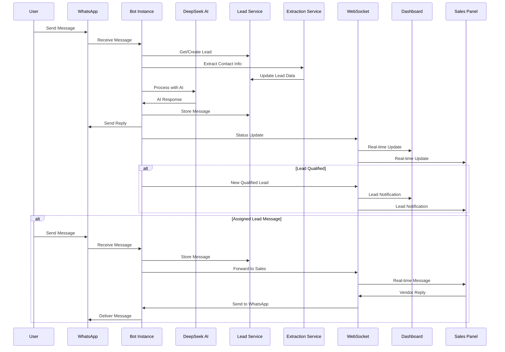
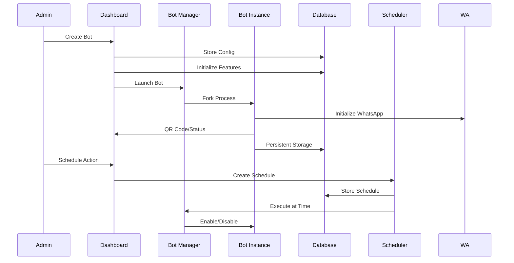
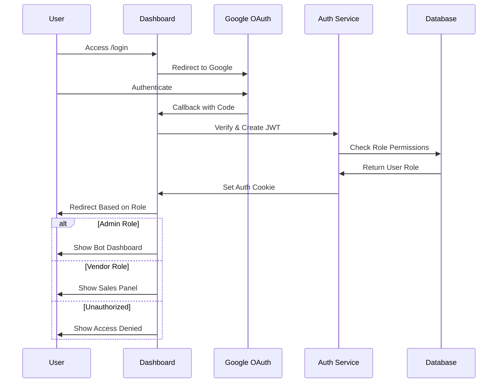

# WhatsApp Bot Manager - Technical Architecture

## Executive Summary

The WhatsApp Bot Manager is a sophisticated multi-tenant platform that enables businesses to deploy and manage multiple AI-powered WhatsApp bots through a centralized dashboard. The system combines intelligent lead capture, automated conversation management, and real-time sales team coordination to streamline customer engagement and lead qualification processes.

## Technology Stack

### Core Platform
- **Runtime**: Node.js 18.x
- **Web Framework**: Express.js 4.18.3
- **Template Engine**: EJS 3.1.9
- **Real-time Communication**: WebSocket (ws 8.16.0)
- **Process Management**: Node.js Child Processes

### AI & Automation
- **AI Service**: DeepSeek Chat API
- **WhatsApp Integration**: whatsapp-web.js (pedroslopez fork)
- **QR Code Generation**: qrcode 1.5.3

### Data Layer
- **Database**: PostgreSQL with pg 8.11.3
- **Session Management**: JWT with jsonwebtoken 9.0.2
- **File Storage**: Railway-managed file system
- **Database Management**: Connection pooling with structured schema

### Authentication & Security
- **OAuth Provider**: Google OAuth 2.0 with passport-google-oauth20 2.0.0
- **Session Security**: JWT tokens with configurable secrets
- **Cookie Management**: cookie-parser 1.4.6

### Infrastructure
- **Deployment Platform**: Railway.app
- **Containerization**: Nixpacks
- **Environment Management**: dotenv 16.4.5

## System Architecture

### High-Level Component Diagram



### Core Components

#### 1. Dashboard Server ([`dashboardServer.js`](dashboardServer.js:1))
- **Primary Responsibilities**:
  - HTTP request handling and routing with Express.js
  - WebSocket server management for real-time communication
  - Bot process orchestration using child processes
  - Role-based access control (Admin/Vendor)
  - Authentication middleware enforcement
  - Database initialization and connection pooling

#### 2. Bot Instance Manager ([`botInstance.js`](botInstance.js:1))
- **Responsibilities**:
  - WhatsApp client initialization and management with whatsapp-web.js
  - AI-powered message processing using DeepSeek API
  - Lead information extraction and qualification
  - Real-time status reporting to dashboard via WebSocket
  - Historical chat loading and processing
  - Outgoing message handling from sales panel

#### 3. Service Layer
- **Database Service** ([`services/db.js`](services/db.js:1)): PostgreSQL connection pooling and management
- **Database Initialization** ([`services/initDb.js`](services/initDb.js:1)): Schema creation and table setup
- **Bot Database Service** ([`services/botDbService.js`](services/botDbService.js:1)): Bot configuration and management
- **Lead Database Service** ([`services/leadDbService.js`](services/leadDbService.js:1)): Lead capture, assignment, and message management
- **Bot Configuration Service** ([`services/botConfigService.js`](services/botConfigService.js:1)): Feature flag management and bot settings
- **Scheduler Service** ([`services/schedulerService.js`](services/schedulerService.js:1)): Automated bot scheduling management
- **Scheduler Executor** ([`services/schedulerExecutor.js`](services/schedulerExecutor.js:1)): Scheduled task execution engine
- **DeepSeek Service** ([`services/deepseekService.js`](services/deepseekService.js:1)): AI conversation handling with DeepSeek API
- **Lead Extraction Service** ([`services/leadExtractionService.js`](services/leadExtractionService.js:1)): Intelligent contact information parsing
- **Chat History Service** ([`services/chatHistoryService.js`](services/chatHistoryService.js:1)): Per-bot conversation history management

#### 4. Authentication Layer
- **Auth Controller** ([`auth/authController.js`](auth/authController.js:1)): Google OAuth callback handling and JWT token generation
- **Passport Configuration** ([`auth/passport.js`](auth/passport.js:1)): Google OAuth strategy setup
- **Auth Middleware** ([`auth/authMiddleware.js`](auth/authMiddleware.js:1)): JWT validation and role-based access control
- **Auth Routes** ([`routes/authRoutes.js`](routes/authRoutes.js:1)): Authentication endpoint routing

#### 5. User Interface
- **Admin Dashboard** ([`views/dashboard.ejs`](views/dashboard.ejs:1)): Bot management interface for administrators
- **Sales Panel** ([`views/sales.ejs`](views/sales.ejs:1)): Lead management and messaging interface for vendors
- **Public Assets** ([`public/style.css`](public/style.css:1)): Styling and frontend resources

## Service Interactions & Data Flow

### Service Communication Patterns



### User Request Processing Flow



### Bot Management Flow



### Authentication & Authorization Flow



### Service Responsibilities Matrix

| Service | Primary Responsibility | Dependencies | Data Stores |
|---------|------------------------|--------------|-------------|
| **Dashboard Server** | HTTP routing, WebSocket management, bot orchestration | All services, PostgreSQL | Session state, active bots |
| **Bot Instance** | WhatsApp client, AI processing, lead capture | DeepSeek API, Lead Service | Local auth, session data |
| **Lead Service** | Lead management, message storage, assignment | PostgreSQL | leads, lead_messages tables |
| **Bot Config Service** | Feature flag management, bot settings | PostgreSQL | bot_features table |
| **Scheduler Service** | Automated task scheduling | PostgreSQL, Scheduler Executor | schedules table |
| **Scheduler Executor** | Task execution engine | Scheduler Service, Bot Manager | In-memory intervals |
| **DeepSeek Service** | AI conversation handling | DeepSeek API | None (stateless) |
| **Lead Extraction Service** | Contact info parsing | DeepSeek API | None (stateless) |
| **Auth Service** | User authentication, JWT management | Google OAuth, PostgreSQL | JWT tokens, user roles |
| **Database Service** | Connection pooling, query execution | PostgreSQL | All application data |

### Real-time Communication Events

| Event Type | Source | Destination | Payload |
|------------|--------|-------------|---------|
| `INIT` | Dashboard Server | WebSocket Clients | Bot list, initial state |
| `UPDATE_BOT` | Bot Instance | Dashboard | Bot status, QR codes |
| `NEW_QUALIFIED_LEAD` | Bot Instance | Dashboard & Sales | Lead information |
| `NEW_MESSAGE_FOR_SALES` | Bot Instance | Sales Panel | Message from assigned lead |
| `LEAD_ASSIGNED` | Lead Service | Dashboard & Sales | Updated lead assignment |
| `MESSAGE_SENT` | Dashboard Server | Sales Panel | Vendor message confirmation |
| `SCHEDULE_CREATED` | Scheduler Service | Dashboard | New schedule details |
| `BOT_FEATURES_UPDATED` | Config Service | Dashboard | Updated feature flags |

## Infrastructure & Deployment

### Hosting Environment
- **Platform**: Railway.app with automatic deployments and PostgreSQL integration
- **Runtime**: Node.js 18.x with Chromium dependency for WhatsApp Web
- **Scaling**: Horizontal scaling through multiple bot instances with PostgreSQL backend
- **Persistence**: Railway-managed PostgreSQL database with connection pooling
- **File Storage**: Railway file system for WhatsApp session data (LocalAuth)

### Container Configuration ([`nixpacks.toml`](nixpacks.toml:1))
```toml
[phases.setup]
nixPkgs = ["nodejs-18_x", "chromium"]

[phases.install]
cmds = ["npm ci --production"]

[start]
cmd = "npm start"
```

### Railway Configuration ([`railway.json`](railway.json:1))
- **Builder**: NIXPACKS
- **Start Command**: `npm start`
- **Restart Policy**: ON_FAILURE with 10 retries
- **Database**: PostgreSQL service with automatic connection management

## Authentication & Security Architecture

### Enhanced OAuth 2.0 Flow with Role-Based Access


### Security Measures
- **JWT Token Management**: Secure token storage in HTTP-only cookies with 7-day expiration
- **Role-Based Access Control**: Admin and Vendor roles with distinct permissions
- **Environment Configuration**: ADMIN_EMAILS and VENDOR_EMAILS for role assignment
- **Session Protection**: Automatic token validation and cleanup
- **Environment Security**: Sensitive configuration in environment variables
- **WebSocket Authentication**: JWT validation for real-time connections
- **Content Security Policy**: CSP headers for XSS protection

## Database Schema

### Bot Management Database ([`services/botDbService.js`](services/botDbService.js))
```sql
CREATE TABLE bots (
    id TEXT PRIMARY KEY NOT NULL,
    name TEXT NOT NULL,
    port INTEGER UNIQUE NOT NULL,
    prompt TEXT NOT NULL,
    status TEXT NOT NULL DEFAULT 'enabled',
    owner_email TEXT NOT NULL,
    created_at TIMESTAMP DEFAULT CURRENT_TIMESTAMP
);
```

### Lead Management Database ([`services/leadDbService.js`](services/leadDbService.js:14))
```sql
CREATE TABLE leads (
    id SERIAL PRIMARY KEY,
    bot_id TEXT NOT NULL,
    whatsapp_number TEXT NOT NULL,
    name TEXT,
    email TEXT,
    location TEXT,
    phone TEXT,
    status TEXT NOT NULL DEFAULT 'capturing',
    assigned_to TEXT,
    captured_at TIMESTAMP DEFAULT CURRENT_TIMESTAMP,
    qualified_at TIMESTAMP,
    last_message_at TIMESTAMP DEFAULT CURRENT_TIMESTAMP,
    UNIQUE(bot_id, whatsapp_number)
);

CREATE TABLE lead_messages (
    id SERIAL PRIMARY KEY,
    lead_id INTEGER NOT NULL REFERENCES leads(id) ON DELETE CASCADE,
    sender TEXT NOT NULL,
    message TEXT NOT NULL,
    timestamp TIMESTAMP DEFAULT CURRENT_TIMESTAMP
);
```

### Feature Configuration Database ([`services/botConfigService.js`](services/botConfigService.js:14))
```sql
CREATE TABLE bot_features (
    id SERIAL PRIMARY KEY,
    bot_id TEXT NOT NULL UNIQUE,
    scheduling_enabled BOOLEAN DEFAULT FALSE,
    auto_response_enabled BOOLEAN DEFAULT TRUE,
    lead_capture_enabled BOOLEAN DEFAULT TRUE,
    working_hours_enabled BOOLEAN DEFAULT FALSE,
    working_hours_start TEXT DEFAULT '09:00',
    working_hours_end TEXT DEFAULT '18:00',
    updated_at TIMESTAMP DEFAULT CURRENT_TIMESTAMP
);
```

### Scheduler Database ([`services/schedulerService.js`](services/schedulerService.js:15))
```sql
CREATE TABLE schedules (
    id SERIAL PRIMARY KEY,
    bot_id TEXT NOT NULL,
    action TEXT NOT NULL,
    scheduled_at TIMESTAMP NOT NULL,
    status TEXT NOT NULL DEFAULT 'pending',
    executed BOOLEAN DEFAULT FALSE,
    executed_at TIMESTAMP,
    created_by TEXT NOT NULL,
    created_at TIMESTAMP DEFAULT CURRENT_TIMESTAMP
);
```

## Core Functionality & Operational Logic

### Recent System Enhancements

#### 1. PostgreSQL Database Migration
- **Migration from SQLite**: Transitioned from file-based SQLite to robust PostgreSQL for better concurrency and scalability
- **Connection Pooling**: Implemented efficient database connection management via [`services/db.js`](services/db.js:1)
- **Schema Updates**: Converted all tables to PostgreSQL-compatible schema with proper foreign key constraints and SERIAL primary keys
- **Data Integrity**: Added ON DELETE CASCADE for lead_messages to maintain referential integrity

#### 2. Role-Based Access Control (RBAC)
- **Dual-Role System**: Implemented Admin and Vendor roles with distinct permissions
- **Admin Dashboard**: Full bot management, configuration, and scheduling capabilities
- **Vendor Sales Panel**: Lead assignment, messaging, and conversation management only
- **Environment Configuration**: Role assignment via ADMIN_EMAILS and VENDOR_EMAILS environment variables
- **Route Protection**: Middleware enforcement of role-based access in [`auth/authMiddleware.js`](auth/authMiddleware.js:1)

#### 3. Enhanced Bot Instance Management
- **Historical Chat Loading**: Bots now load and process existing WhatsApp conversations on startup without generating responses
- **Ready State Management**: Introduced `isReady` flag to prevent bot responses during historical data loading
- **Improved Error Handling**: Enhanced initialization retry logic with exponential backoff
- **Memory Optimization**: Better resource management for multiple bot instances

#### 4. Advanced Lead Management
- **Progressive Lead Qualification**: Multi-stage capture process (capturing → qualified → assigned)
- **Intelligent Information Extraction**: AI-powered parsing of contact details from natural conversations
- **Vendor Assignment System**: Leads can be assigned to specific vendors for follow-up
- **Message Continuity**: Seamless handoff from bot to human sales representatives

#### 5. Real-time Communication Enhancements
- **WebSocket Authentication**: JWT-based authentication for WebSocket connections
- **Role-specific Events**: Different event streams for admin dashboard vs sales panel
- **Bi-directional Messaging**: Sales team can send messages directly through bot instances
- **Live Status Updates**: Real-time bot status, lead notifications, and message synchronization

### Multi-Tenant Bot Architecture
- **Isolated Instances**: Each bot runs in separate child processes with independent WhatsApp sessions
- **Independent Authentication**: Unique LocalAuth sessions per bot using clientId-based storage
- **Configurable Prompts**: Custom AI behavior and system prompts per bot instance
- **Resource Management**: Automatic process cleanup, restart, and memory optimization
- **Port Management**: Dynamic port assignment for bot instances with collision prevention

### Intelligent Lead Capture System
1. **Initial Contact**: Bot engages user with AI-powered responses using DeepSeek API
2. **Information Extraction**: Uses [`services/leadExtractionService.js`](services/leadExtractionService.js:1) to parse contact details from conversations
3. **Progressive Qualification**: Systematically collects name, email, location, phone through natural dialogue
4. **Automatic Handoff**: Qualified leads automatically appear in sales panel for vendor assignment
5. **Conversation Continuity**: Sales team can continue conversations seamlessly through the same bot instance
6. **Historical Processing**: Existing WhatsApp chats are loaded and processed without generating duplicate responses

### Real-time Communication Framework
- **WebSocket Events**: Live bot status, lead notifications, message updates, and scheduling events
- **Bi-directional Communication**: Dashboard to bots, bots to dashboard, and sales panel interactions
- **State Synchronization**: Consistent view across all connected clients with role-based data filtering
- **Event-driven Architecture**: Reactive updates based on system events with JWT authentication
- **Connection Management**: Automatic reconnection and authentication validation

### Automated Scheduling System
- **Time-based Actions**: Enable/disable bots at specified times with timezone support
- **Recurring Task Execution**: 30-second interval for checking and executing pending schedules via [`services/schedulerExecutor.js`](services/schedulerExecutor.js:1)
- **Feature Gates**: Scheduling functionality controlled by bot-specific feature flags
- **Audit Trail**: Complete history of scheduled actions, executions, and status changes
- **Real-time Updates**: Immediate feedback on schedule creation, execution, and cancellation

## Scalability Considerations

### Current Architecture Strengths
- **Process Isolation**: Bot failures don't affect dashboard or other bots
- **Horizontal Scaling**: Can deploy multiple dashboard instances with PostgreSQL backend
- **Stateless Authentication**: JWT tokens enable distributed sessions across instances
- **Connection Pooling**: Efficient database connection management for concurrent access
- **Role-Based Access**: Granular permission system supports multiple user types

### Current Architecture Improvements
- **PostgreSQL Integration**: Resolved SQLite single-writer constraint with proper concurrent access
- **Enhanced Memory Management**: Improved bot instance lifecycle and resource cleanup
- **WebSocket Authentication**: Secure real-time communication with JWT validation
- **Database Schema Optimization**: Proper indexing and foreign key relationships

### Potential Scaling Challenges
- **Memory Management**: Multiple Chromium instances in bot processes remain resource-intensive
- **WebSocket Connections**: Scaling real-time connections across multiple dashboard instances
- **Bot Process Limits**: Maximum concurrent bot instances per server due to Chromium memory usage
- **Database Connection Limits**: PostgreSQL connection pool sizing for high concurrent usage

### Recommended Scaling Path
1. **Container Orchestration**: Deploy bot instances as separate containers with resource limits
2. **Message Queue**: Implement Redis or RabbitMQ for event distribution and background processing
3. **Load Balancing**: Add load balancer for multiple dashboard instances with sticky sessions
4. **Database Optimization**: Implement read replicas and connection pooling optimization
5. **Bot Instance Pooling**: Dynamic bot instance management with auto-scaling based on demand
6. **Caching Layer**: Add Redis caching for frequently accessed bot configurations and lead data

### Performance Optimizations Implemented
- **Database Connection Pooling**: Efficient connection reuse via [`services/db.js`](services/db.js:1)
- **Exponential Backoff**: Bot initialization retry logic with increasing delays
- **Historical Chat Optimization**: Batch processing of existing conversations without response generation
- **WebSocket Message Batching**: Efficient real-time updates with minimal overhead
- **Role-Based Data Filtering**: Reduced data transfer by sending only relevant information to each role

## Monitoring & Observability

### Built-in Monitoring
- **Process Health**: Automatic bot restart on failure
- **Connection Status**: Real-time WhatsApp connection monitoring
- **Lead Pipeline**: Track lead conversion and qualification rates
- **Scheduler Execution**: Audit trail for automated actions

### Operational Metrics
- **Bot Uptime**: Individual bot connection stability
- **Message Throughput**: Conversation volume per bot
- **Lead Conversion**: Capture to qualification ratios
- **AI Response Times**: DeepSeek API performance

This architecture provides a robust foundation for managing multiple WhatsApp bots with intelligent lead capture, real-time coordination, and scalable infrastructure designed for business-grade deployment.